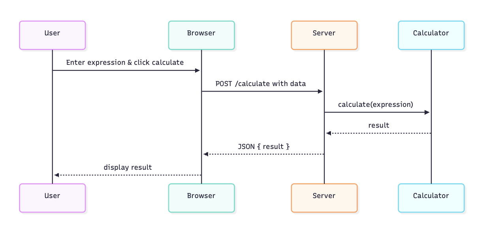
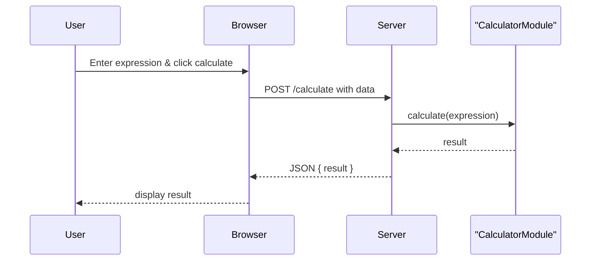
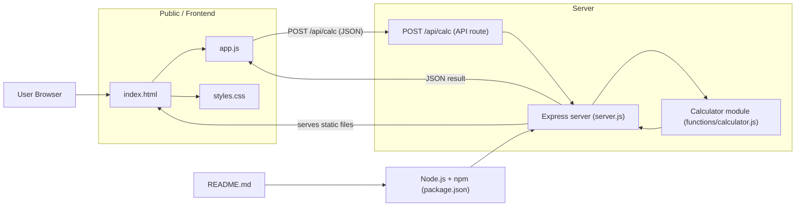

# File map — simple-calculator-app

Very brief descriptions of the repository files.

- `package.json`: npm manifest with scripts (`start`, `dev`) and dependencies.
- `server.js`: Express server; serves static files and exposes POST `/api/calc` API.
- `functions/calculator.js`: Calculator logic (`calculate(op, a, b)`) and error handling.
- `public/index.html`: Frontend HTML UI for the calculator.
- `public/app.js`: Frontend JavaScript — sends requests to `/api/calc` and updates the UI.
- `public/styles.css`: Minimal styles for the UI.
- `README.md`: Project overview and run instructions.
- `.gitignore`: Files and folders to ignore (e.g., `node_modules`).
- `FILES.md`: This concise file map.

To view below files - command+shift+v
==============================

===============================

